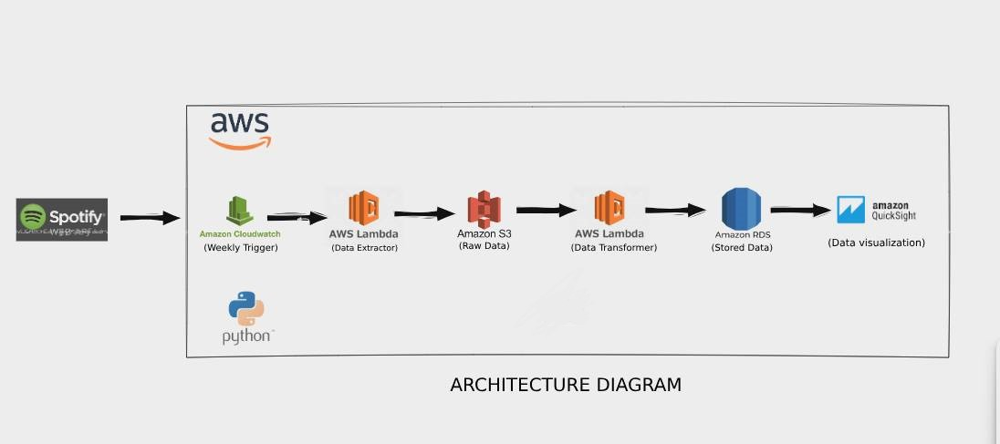

# Spotify Data Pipeline with AWS

This project is an automated data pipeline designed to extract data from the Spotify API, process it, and store it in Amazon RDS. The pipeline culminates in visualizing the data using Amazon QuickSight. Orchestrated by various AWS services, including Amazon CloudWatch, the pipeline runs on a weekly schedule to ensure the data remains up-to-date.

## Architecture Overview

The pipeline consists of several key stages:

1. **Data Extraction**:
   - **Amazon CloudWatch**: Initiates the pipeline weekly.
   - **AWS Lambda (Data Extractor)**: Executes a Python script that pulls raw data from the Spotify API and uploads it to Amazon S3.

2. **Data Storage**:
   - **Amazon S3**: Stores the raw data extracted from Spotify for subsequent processing.

3. **Data Transformation**:
   - **AWS Lambda (Data Transformer)**: Processes the raw data from S3, transforming it into a suitable format for analysis, and then pushes the transformed data to Amazon RDS.

4. **Data Storage**:
   - **Amazon RDS (Postgres DB)**: Holds the transformed data, making it easily queryable for further analysis. A **VPC** was utilized to create the database, ensuring it is publicly accessible.

5. **Data Visualization**:
   - **Amazon QuickSight**: Connects to Amazon RDS to create interactive dashboards and visualizations, providing insights based on the Spotify data.

## Technologies Used

- **Spotify API**: For data extraction
- **AWS Lambda**: Serverless functions for data extraction and transformation
- **Amazon CloudWatch**: Manages automated weekly triggers
- **Amazon S3**: Serves as storage for raw data
- **Amazon RDS**: Relational database service for storing transformed data
- **Amazon QuickSight**: Visualization tool for creating dashboards
- **Python**: Utilized for scripting and data manipulation within AWS Lambda functions
